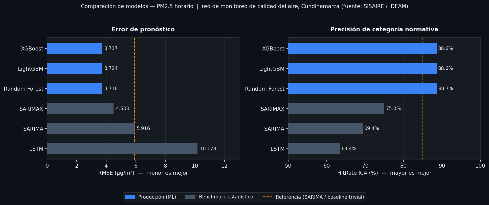
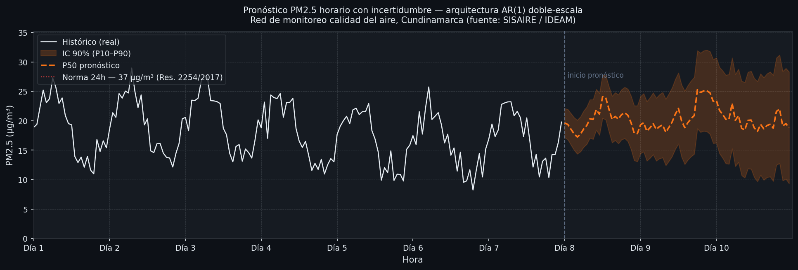

# Estadística Ambiental

> Base de conocimiento Python para el **ciclo estadístico completo** aplicado a datos ambientales —
> EDA, estadística descriptiva e inferencial, modelos predictivos y reportes de cumplimiento normativo.
> Metodología de estándares internacionales (ISO, WMO, literatura peer-reviewed) con implementación de referencia para Colombia.

> **Nota:** el repositorio cubre 16 líneas temáticas (páramos, humedales, calidad del aire, oferta hídrica,
> áreas protegidas y más). Cada línea tiene su propia ficha de dominio, notebook plantilla y normas
> colombianas integradas en el código.

[](https://github.com/DanMendezZz/Estadistica_Ambiental/actions/workflows/ci.yml)
[](https://codecov.io/gh/DanMendezZz/Estadistica_Ambiental)
[](https://www.python.org/)
[]()
[]()
[]()
[](https://danmendezzz.github.io/Estadistica_Ambiental/)
[](LICENSE)

---

## Tabla de contenido

1. [Motivación](#motivación)
2. [Metodología](#metodología)
3. [Resultados y validación](#resultados-y-validación)
4. [Estructura del proyecto](#estructura-del-proyecto)
5. [Instalación](#instalación)
6. [Quick Start](#quick-start)
7. [Catálogo de modelos](#catálogo-de-modelos)
8. [16 Líneas temáticas](#16-líneas-temáticas)
9. [Normativa colombiana integrada](#normativa-colombiana-integrada)
10. [Reportes automáticos](#reportes-automáticos)
11. [Flujo por línea temática](#flujo-por-línea-temática)
12. [Compatibilidad y extras](#compatibilidad-y-extras)
13. [Atribución](#atribución)

---

## Motivación

Los analistas de entidades ambientales colombianas (CAR, IDEAM, MADS, alcaldías) enfrentan un problema
recurrente: **cada proyecto estadístico parte de cero**. Los datos cambian, la variable también, pero el
ciclo analítico es siempre el mismo — cargar, validar, describir, inferir, modelar, reportar.

Este repositorio resuelve eso con una **base de conocimiento reutilizable** que combina tres cosas
que raramente aparecen juntas en un solo lugar:

- **Metodología documentada** — decisiones de diseño (ADR-001 a ADR-013), buenas prácticas calibradas
  sobre datos reales y fichas de dominio por línea temática.
- **Normas colombianas en el código** — Res. 2254/2017 (calidad del aire), 2115/2007 (agua potable),
  631/2015 (vertimientos) e índices IDEAM listos para usarse con un solo import, sin hardcodear umbrales.
- **Código validado sobre datos reales** — el pipeline de calidad del aire fue ejecutado sobre series
  horarias de PM2.5 de una red de monitoreo en Cundinamarca (fuente: SISAIRE / IDEAM). Los resultados
  son reproducibles con los datos públicos de la plataforma.

El repo no reemplaza el juicio del analista; **documenta el camino** para que no tenga que redescubrirlo
cada vez.

> **Alcance metodológico:** los métodos estadísticos implementados (SARIMA, Kriging, GWR, I de Moran,
> XGBoost, Prophet, etc.) son estándares internacionales aplicables a cualquier contexto ambiental.
> La capa de dominio — normas regulatorias, fuentes de datos, umbrales, índices — está calibrada para
> Colombia y el Sistema Nacional Ambiental (SINA). Adaptar el repo a otro país implica únicamente
> reemplazar las constantes de `config.py` con la normativa local.

---

## Metodología

El ciclo estadístico está implementado como **módulos independientes y encadenables**. Cada línea
temática recorre el ciclo completo o solo las etapas que aplican.

### 1 — Ingesta y validación

`io/loaders.py` lee CSV, Excel, Parquet, NetCDF y Shapefile. `io/validators.py` aplica **74 rangos
físicos calibrados** (temperatura, caudal, pH, PM2.5, OD, NDVI, etc.) con sobrescrituras por línea
temática (`linea_tematica="paramos"` ajusta temperatura máx a 16 °C en lugar de 45 °C).

```python
from estadistica_ambiental.io.loaders import load_csv
from estadistica_ambiental.io.validators import validate

df  = load_csv("data/raw/pm25_sisaire.csv", date_col="fecha")
val = validate(df, date_col="fecha", linea_tematica="calidad_aire")
```

### 2 — Análisis Exploratorio (EDA)

`eda/quality.py` detecta faltantes (patrón MCAR/MAR/MNAR), duplicados, inconsistencias temporales y
congelamiento de sensor. `eda/profiling.py` genera un reporte HTML con `ydata-profiling` o con la
plantilla propia del repo cuando el extra `[profile]` no está instalado.

### 3 — Estadística descriptiva

`descriptive/` cubre univariada (media, mediana, IQR, asimetría, curtosis), bivariada (Pearson,
Spearman, Kendall, tablas de contingencia) y temporal (descomposición STL, ACF/PACF, rolling stats).

### 4 — Estadística inferencial

`inference/stationarity.py` implementa **ADF + KPSS de forma obligatoria** antes de cualquier modelo
ARIMA (ADR-004). `inference/trend.py` expone Mann-Kendall, Sen's slope y Pettitt. `inference/intervals.py`
calcula excedencias contra normas colombianas y guías OMS 2021:

```python
from estadistica_ambiental.inference.stationarity import stationarity_report
from estadistica_ambiental.inference.trend import mann_kendall
from estadistica_ambiental.inference.intervals import exceedance_report

stationarity_report(ts)           # ADF + KPSS combinados
mk = mann_kendall(ts)
print(f"Tendencia: {mk['trend']} | slope={mk['slope']:.4f}")

print(exceedance_report(ts, variable="pm25"))
# → tabla vs. Res. 2254/2017 (37 µg/m³ 24h) y OMS 2021 (15 µg/m³)
```

### 5 — Covariables climáticas (ENSO/ONI)

`features/climate.py` descarga el Índice Oceánico El Niño (ONI) desde NOAA CPC y aplica el **lag
hidrológico específico por línea temática** (páramos: 2 meses, oferta hídrica: 4 meses, calidad del
aire: 2 meses). El lag viene de `config.ENSO_LAG_MESES` y es sobrescribible:

```python
from estadistica_ambiental.features.climate import load_oni, enso_lagged

oni = load_oni()
df  = enso_lagged(df, oni, date_col="fecha", linea_tematica="oferta_hidrica")
```

### 6 — Modelado predictivo con optimización bayesiana

`predictive/registry.py` expone un catálogo uniforme de 10 modelos. `optimization/bayes_opt.py`
usa **Optuna TPE con `multivariate=True`** para ajustar hiperparámetros. `evaluation/backtesting.py`
implementa walk-forward expanding/sliding con parámetro `gap=` para evitar leakage en series con
autocorrelación alta (crítico en PM2.5 horario con ACF ≈ 0.97):

```python
from estadistica_ambiental.predictive.registry import get_model
from estadistica_ambiental.evaluation.backtesting import walk_forward
from estadistica_ambiental.evaluation.comparison import rank_models

models = {
    "XGBoost":     get_model("xgboost", lags=[1, 2, 3, 6, 12, 24]),
    "SARIMA":      get_model("sarima", order=(1,1,1), seasonal_order=(1,1,1,24)),
    "RandomForest": get_model("random_forest", lags=[1, 2, 3, 6, 12, 24]),
}
results = {
    name: walk_forward(model, ts, horizon=24, n_splits=5,
                       gap=24, domain="air_quality")
    for name, model in models.items()
}
rank_models(results)[["rmse", "nrmse", "hit_rate_ica", "rank"]]
```

### 7 — Cumplimiento normativo y reporte HTML

`reporting/compliance_report.py` genera un HTML independiente con semáforo por variable,
tabla de excedencias con cada norma colombiana aplicable y período de retorno. La lógica de
cálculo vive en `inference/intervals.py` (testeable de forma aislada — ADR-008):

```python
from estadistica_ambiental.reporting.compliance_report import compliance_report

compliance_report(df, variables=["pm25", "pm10"],
                  linea_tematica="calidad_aire",
                  output="data/output/reports/cumplimiento.html")
```

---

## Resultados y validación

### Comparación de modelos — PM2.5 horario

Backtesting walk-forward (`gap=24h`, 5 folds) sobre series horarias de PM2.5.
Fuente de datos: SISAIRE / IDEAM, red de monitoreo calidad del aire, Cundinamarca.

| Modelo | RMSE (µg/m³) | NRMSE | HitRate ICA | Recall >55 µg/m³ | Rol |
|---|---|---|---|---|---|
| **XGBoost** | **3.717** | **0.426** | 88.61% | **15.50%** | Producción |
| LightGBM | 3.724 | 0.427 | 88.62% | 13.69% | Producción |
| Random Forest | 3.716 | 0.426 | **88.67%** | 13.15% | Producción |
| SARIMAX | ~4.5 | — | ~75% | — | Con meteo disponible |
| SARIMA | 5.916 | 0.872 | 69.39% | 0% | Benchmark estadístico |
| LSTM | 10.178 | 1.211 | 63.44% | 0.82% | Referencia deep |

> Score combinado = 30% RMSE normalizado + 10% NRMSE + 25% HitRate ICA + 20% F1 ponderado + 15% Recall >55 µg/m³



**Hallazgo clave:** para series horarias con ACF alta (≈ 0.97 en lag-1h), los modelos ML con
lag features superan ampliamente a SARIMA. El gap de 24h en walk-forward redujo el learning
curve gap de 0.38 a 0.048 — sin gap, el R² está inflado por leakage de autocorrelación.

### Pronóstico con bandas de incertidumbre

La arquitectura **AR(1) doble-escala** genera pronósticos probabilísticos (P10/P50/P90) sin
reentrenar el modelo base:

```
ŷ(t) = base_RF(t)                         ← componente estacional/tendencia
      + Δ_nivel × exp(−t / τ)             ← corrección nivel sinóptica (τ ≈ 48–185 h)
      + e_AR(t), donde e_AR(t) = φ·e_AR(t−1) + σ·ε(t)   ← AR(1) horario (φ ≈ 0.63–0.93)
```



### Caso de uso productivo: pipeline CAR (Cundinamarca)

El proyecto hermano **"Calidad de aire CAR"** (red SISAIRE / IDEAM, 34 estaciones, 2016–2026)
es la primera validación operacional del repo en datos reales. Confirma de forma independiente
varias decisiones del repo:

- `walk_forward(gap=24)` — el gap de 24 h fue redescubierto en CAR por leakage de autocorrelación PM2.5 (r ≈ 0.97 lag-1h).
- `exceedance_report()` con Res. 2254/2017 y OMS 2021 — utilizado en backtesting 2025 y reporte ejecutivo.
- `enso_lagged(lag_meses=2)` para calidad del aire — coincidencia con la literatura colombiana.

Métricas en producción: **RMSE = 3.717 µg/m³**, **HitRate ICA = 88.61 %**, **27/31 estaciones AR(1) PASS**
(tests T1–T4 + KS + Ljung-Box + Jarque-Bera). El feedback recíproco está documentado en
[`Plan/Feedback/repo_estadistica_ambiental_feedback.md`](Plan/Feedback/repo_estadistica_ambiental_feedback.md).

---

## Estructura del proyecto

```
Estadistica_Ambiental/
│
├── src/estadistica_ambiental/
│   ├── config.py                  ← normas colombianas, ENSO lags, rutas
│   │
│   ├── io/
│   │   ├── loaders.py             ← CSV · Excel · Parquet · NetCDF · Shapefile
│   │   ├── validators.py          ← 74 rangos físicos + sobrescrituras por línea
│   │   └── connectors.py          ← OpenAQ · RMCAB · SIATA · IDEAM DHIME · SMByC
│   │
│   ├── eda/
│   │   ├── profiling.py           ← reporte HTML automático (ydata-profiling / propio)
│   │   ├── quality.py             ← faltantes · duplicados · congelamiento de sensor
│   │   ├── variables.py           ← tipificación automática de columnas
│   │   └── viz.py                 ← series · boxplots · heatmaps · missingno
│   │
│   ├── preprocessing/
│   │   ├── imputation.py          ← lineal · rolling · KNN · MICE
│   │   ├── outliers.py            ← IQR opt-in (ADR-002: picos ambientales = señal real)
│   │   └── air_quality.py         ← flag_spatial_episodes · categorize_ica · correct_seasonal_bias
│   │
│   ├── descriptive/
│   │   ├── univariate.py          ← media · mediana · IQR · asimetría · curtosis
│   │   ├── bivariate.py           ← Pearson · Spearman · Kendall · contingencia
│   │   └── temporal.py            ← STL · ACF · PACF · rolling stats
│   │
│   ├── inference/
│   │   ├── stationarity.py        ← ADF + KPSS obligatorios (ADR-004)
│   │   ├── trend.py               ← Mann-Kendall · Sen's slope · Pettitt
│   │   ├── hypothesis.py          ← t-test · Mann-Whitney · ANOVA · Kruskal-Wallis
│   │   ├── distributions.py       ← Shapiro-Wilk · lognormal · gamma · Weibull · Gumbel
│   │   └── intervals.py           ← exceedance_report() vs. normas CO + OMS
│   │
│   ├── features/
│   │   ├── lags.py                ← lag features configurables
│   │   ├── calendar.py            ← encoding cíclico (hora · día · semana)
│   │   ├── climate.py             ← enso_lagged() · load_oni() — lag por línea (ADR-007)
│   │   └── exogenous.py           ← alineación de covariables meteorológicas
│   │
│   ├── predictive/
│   │   ├── registry.py            ← get_model() · list_models() · register()
│   │   ├── classical.py           ← ARIMA · SARIMA · SARIMAX · ETS
│   │   ├── prophet_model.py       ← Prophet con exógenas
│   │   ├── ml.py                  ← XGBoost · RandomForest · LightGBM
│   │   ├── deep.py                ← LSTM · GRU (requiere [deep])
│   │   ├── spatial_models.py      ← Kriging · GP espacio-temporal
│   │   └── base.py                ← BaseModel · OptimizationResult · ModelSpec
│   │
│   ├── optimization/
│   │   └── bayes_opt.py           ← Optuna TPE multivariate · warm starts · MedianPruner
│   │
│   ├── evaluation/
│   │   ├── metrics.py             ← MAE · RMSE · NSE · KGE · hit_rate_ica por contaminante
│   │   ├── backtesting.py         ← walk_forward(gap=) · expanding · sliding
│   │   ├── comparison.py          ← rank_models() · select_best()
│   │   └── anomaly.py             ← detect_anomalies() · anomaly_summary()
│   │
│   └── reporting/
│       ├── compliance_report.py   ← HTML semáforo normativo (ADR-008)
│       ├── forecast_report.py     ← HTML forecast interactivo con Chart.js
│       └── stats_report.py        ← HTML descriptiva + ADF/KPSS + Mann-Kendall
│
├── docs/
│   ├── fuentes/                   ← 16 fichas técnicas de dominio ✅
│   │   └── calidad_aire.md        ← variables · ICA µg/m³ · buenas prácticas BP-1 a BP-7
│   ├── decisiones.md              ← ADR-001 a ADR-013
│   ├── metodologia.md             ← ciclo estadístico detallado
│   ├── modelos.md                 ← catálogo de modelos y cuándo usar cada uno
│   └── intake_lider.md            ← cuestionario onboarding líderes de área (18 preguntas)
│
├── notebooks/lineas_tematicas/
│   ├── bloque_a_gestion/          ← 13 notebooks (uno por línea temática)
│   ├── bloque_b_transversales/    ← calidad_aire · cambio_climatico
│   └── bloque_c_tecnicas/         ← geoespacial
│
├── scripts/
│   ├── run_linea_tematica.py      ← CLI unificado: --linea · --modelos · --list
│   ├── fase8_calidad_aire.py      ← showcase con datos reales PM2.5 SISAIRE
│   └── build_notebooks.py         ← regenera los 16 notebooks desde plantilla
│
└── tests/                         ← 284 tests · 80% cobertura · CI ubuntu + windows
```

---

## Instalación

### Core

```bash
git clone https://github.com/DanMendezZz/Estadistica_Ambiental.git
cd Estadistica_Ambiental
pip install -e ".[dev]"
```

### Con modelos ML (XGBoost · LightGBM)

```bash
pip install -e ".[dev,ml]"
```

### Extras individuales

```bash
pip install -e ".[prophet]"    # Meta Prophet
pip install -e ".[spatial]"    # geopandas · rasterio · pykrige · pysal · folium
pip install -e ".[deep]"       # PyTorch — LSTM · GRU
pip install -e ".[profile]"    # ydata-profiling · sweetviz · missingno
pip install -e ".[fast]"       # polars — carga rápida de parquets grandes
```

### Dependencias core

Python 3.10+ con: `pandas`, `numpy`, `scipy`, `statsmodels`, `scikit-learn`, `optuna`,
`hydroeval`, `pymannkendall`, `matplotlib`, `seaborn`, `requests`.
Ver `pyproject.toml` para la lista completa.

### Verificar

```bash
python -m pytest tests/ -q
# 284 passed, 1 skipped, ~80% coverage
```

---

## Consumir desde otro proyecto (este repo es base de conocimiento)

Este repositorio es **base de conocimiento + librería reutilizable**, no un
producto final. Los dashboards, apps Streamlit, reportes ejecutivos y pipelines
productivos viven en **repos satélite** que importan `estadistica_ambiental`
como dependencia.

```
Estadistica_Ambiental (este repo — base)
   ├── 16 fichas de dominio
   ├── 11 módulos del pipeline (io · eda · inference · predictive · ...)
   ├── 16 notebooks plantilla
   └── ADRs y decisiones metodológicas
            ↑
            │ pip install git+https://github.com/DanMendezZz/Estadistica_Ambiental@v1.3.0
            │
   ┌────────┴────────┬─────────────────┬──────────────┐
   │                 │                 │              │
calidad-aire-car   pomca-magdalena   paramos-rabanal   …  ← repos satélite
   ├── Streamlit    ├── ETL nocturno  ├── notebook ad-hoc
   └── deploy       └── reportes      └── informe técnico
```

### Instalación desde GitHub

```bash
# Última versión estable (recomendado para satélites — pinear a tag)
pip install "git+https://github.com/DanMendezZz/Estadistica_Ambiental@v1.3.0"

# Con extras (ML, espacial, deep, etc.)
pip install "estadistica-ambiental[ml,spatial] @ git+https://github.com/DanMendezZz/Estadistica_Ambiental@v1.3.0"

# Versión en desarrollo (rama main — sin garantías de estabilidad)
pip install "git+https://github.com/DanMendezZz/Estadistica_Ambiental@main"
```

> **Pin a tag siempre** en repos satélite. Evita que un commit en `main` rompa
> producción sin aviso. Cuando salga `v1.4.0` actualizas conscientemente.

### Documentación navegable

Sitio mkdocs-material con API reference auto-generada, ADRs, fichas de dominio
y changelog: **<https://danmendezzz.github.io/Estadistica_Ambiental/>**.

Para construir el sitio localmente:

```bash
pip install -e ".[docs]"
mkdocs serve
```

### Imports típicos en un repo satélite

```python
# Conectores y validación
from estadistica_ambiental.io.connectors import load_sisaire_local, load_openaq
from estadistica_ambiental.io.validators import validate

# Reglas de dominio (normas colombianas, ENSO, ICA)
from estadistica_ambiental.config import NORMA_CO, NORMA_OMS, ENSO_LAG_MESES
from estadistica_ambiental.features.climate import enso_lagged, load_oni

# Análisis y reportes
from estadistica_ambiental.inference.intervals import exceedance_report
from estadistica_ambiental.inference.stationarity import stationarity_report
from estadistica_ambiental.evaluation.backtesting import walk_forward
from estadistica_ambiental.reporting.compliance_report import compliance_report
```

### Qué SÍ vive en este repo (base)

- Módulos reusables del ciclo estadístico (`src/estadistica_ambiental/`).
- Conectores genéricos a fuentes públicas (OpenAQ, SISAIRE, RMCAB, IDEAM…).
- Notebooks plantilla por línea temática (`notebooks/lineas_tematicas/`).
- Fichas de dominio (`docs/fuentes/`) y ADRs (`docs/decisiones.md`).
- Tests, CI, documentación metodológica.

### Qué NO vive aquí (va en repos satélite)

- Apps Streamlit / dashboards de cliente concreto.
- Pipelines ETL nocturnos con configuración de deploy.
- Reportes ejecutivos automatizados con identidad visual de una entidad.
- Datos crudos (sin importar tamaño — usar `SISAIRE_LOCAL_DIR` u otro).
- Credenciales, tokens API, URLs internas.

### Compatibilidad de versiones

Sigue [SemVer](https://semver.org). Los breaking changes en API pública se
marcan con bump MAJOR y se documentan en [`CHANGELOG.md`](CHANGELOG.md). Hasta
v1.x los símbolos exportados desde `from estadistica_ambiental import *` son
estables.

---

## Datos reales (uso opcional, sin duplicar)

El repo no incluye datos crudos. Para trabajar con descargas locales del portal
**SISAIRE / IDEAM** (CSV anuales `CAR_<año>.csv`) se referencia la carpeta
externa con una **variable de entorno** — el repo nunca asume una ruta fija.

### 1. Configurar la variable de entorno

```powershell
# Windows (PowerShell, persistente)
setx SISAIRE_LOCAL_DIR "D:\ruta\a\Datos SISAIRE\00_Datos_Originales"
```

```bash
# Linux/macOS (en .bashrc / .zshrc)
export SISAIRE_LOCAL_DIR="/ruta/a/Datos SISAIRE/00_Datos_Originales"
```

### 2. Cargar datos sin copiarlos al repo

```python
from estadistica_ambiental.io.connectors import load_sisaire_local

# Todos los años disponibles, una estación
df = load_sisaire_local(parametro="pm25", estaciones=["BOGOTA RURAL - MOCHUELO"])

# Año específico, todas las estaciones
df = load_sisaire_local(anios=2024, parametro="pm25")

# Multi-año
df = load_sisaire_local(anios=[2023, 2024, 2025], parametro="pm25")
```

`load_sisaire_local()` lee los CSV `CAR_<año>.csv` directamente desde la carpeta
externa, normaliza encabezados (`Estacion` → `estacion`, `Fecha inicial` →
`fecha`, `PM2.5` → `pm25`) y entrega un DataFrame listo para el pipeline
(`validate()`, `exceedance_report()`, `walk_forward()`, `compliance_report()`).

Si la variable no está configurada o se pasa una ruta inexistente, se levanta
`FileNotFoundError` con instrucciones claras. Tests con archivos sintéticos en
`tests/test_connectors.py::TestLoadSisaireLocal`.

---

## Quick Start

### Análisis completo de una serie ambiental

```python
from estadistica_ambiental.io.loaders import load_csv
from estadistica_ambiental.io.validators import validate
from estadistica_ambiental.eda.profiling import run_eda
from estadistica_ambiental.inference.stationarity import stationarity_report
from estadistica_ambiental.inference.trend import mann_kendall
from estadistica_ambiental.inference.intervals import exceedance_report

df  = load_csv("data/raw/pm25_sisaire.csv", date_col="fecha")
validate(df, date_col="fecha", linea_tematica="calidad_aire")
run_eda(df, output="data/output/reports/eda.html", date_col="fecha")

ts = df.set_index("fecha")["pm25"]
stationarity_report(ts)
mk = mann_kendall(ts)
print(f"Tendencia: {mk['trend']} | slope={mk['slope']:.4f} µg/m³/año")
print(exceedance_report(ts, variable="pm25"))
```

### Backtesting multi-modelo con ranking

```python
from estadistica_ambiental.predictive.registry import get_model
from estadistica_ambiental.evaluation.backtesting import walk_forward
from estadistica_ambiental.evaluation.comparison import rank_models

models = {
    "XGBoost":     get_model("xgboost", lags=[1, 2, 3, 6, 12, 24]),
    "Prophet":     get_model("prophet"),
    "SARIMA":      get_model("sarima", order=(1,1,1), seasonal_order=(1,1,1,24)),
}
results = {
    name: walk_forward(model, ts, horizon=24, n_splits=5, gap=24, domain="air_quality")
    for name, model in models.items()
}
rank_models(results)[["rmse", "hit_rate_ica", "rank"]]
```

### Ejecutar el ciclo completo desde la línea de comandos

```bash
python scripts/run_linea_tematica.py --list                          # ver las 16 líneas
python scripts/run_linea_tematica.py --linea oferta_hidrica          # datos sintéticos
python scripts/run_linea_tematica.py --linea paramos --modelos sarima,xgboost
python scripts/fase8_calidad_aire.py                                 # datos reales SISAIRE
```

### Snippets cortos por línea temática (`examples/`)

Para ver el patrón sin abrir un notebook completo, `examples/` contiene scripts
runnables (autocontenidos: caen a datos sintéticos si no hay descarga local):

```bash
python examples/00_quickstart.py             # ciclo mínimo: cargar → validar → describir
python examples/01_calidad_aire_pm25.py      # exceedance_report contra Res. 2254 + OMS 2021
python examples/02_oferta_hidrica_caudal.py  # NSE/KGE + ADF
python examples/03_paramos_iuh.py            # IRH + gradiente Caldas-Lang
python examples/04_cambio_climatico_co2.py   # Mann-Kendall + Sen slope
python examples/05_eda_generico.py           # run_eda + reporte HTML
```

### Notebook end-to-end con datos reales

`notebooks/showcases/calidad_aire_sisaire_real.ipynb` ejecuta el ciclo completo
sobre datos SISAIRE/CAR reales (vía `load_sisaire_local()`) o sintéticos
(fallback automático si `SISAIRE_LOCAL_DIR` no está configurada).

---

## Catálogo de modelos

| Modelo | Extra | Cuándo usarlo |
|---|---|---|
| ARIMA / SARIMA | — | Baseline; series mensuales o diarias con estacionalidad clara |
| SARIMAX | — | SARIMA + covariables meteorológicas disponibles |
| ETS / Holt-Winters | — | Baseline rápido sin exógenas |
| Prophet | `[prophet]` | Estacionalidades múltiples, eventos especiales, gaps tolerables |
| XGBoost | `[ml]` | **Producción** — PM2.5 horario · caudal diario · series con muchas exógenas |
| LightGBM | `[ml]` | Igual que XGBoost, más rápido en datasets grandes |
| Random Forest | — | Robusto sin tuning agresivo; buena línea base ML |
| LSTM / GRU | `[deep]` | Series largas (>5 años), cuando hay GPU disponible |
| Kriging / GP | `[spatial]` | Interpolación espacio-temporal entre estaciones |
| PyMC / Bayesian | `[bayes]` | Incertidumbre jerárquica multi-estación (stub — Fase 10) |

Todos los modelos comparten la misma interfaz y son comparables con `walk_forward` + `rank_models`.

---

## 16 Líneas temáticas

### Bloque A — Gestión ambiental (13 líneas)

| Línea | Variable principal | Norma clave | ENSO lag |
|---|---|---|---|
| Áreas protegidas | cobertura (ha) · NDVI | SMByC deforestación | — |
| Humedales | nivel agua (m) | Protocolo IDEAM | 3m |
| Páramos | temperatura (°C) · precipitación | Política Páramos | 2m |
| Gestión de riesgo | precipitación (mm) | Ley 1523/2012 | 3m |
| Oferta hídrica | caudal (m³/s) | IUA · IRH (IDEAM/ENA) | 4m |
| POMCA | caudal (m³/s) | Decreto 1640/2012 | 4m |
| PUEEA | consumo agua (m³) | Res. 2115/2007 | 3m |
| Recurso hídrico | OD · pH · DBO5 | Res. 2115/2007 | 3m |
| Rondas hídricas | caudal (m³/s) · vegetación | Decreto 2811/1974 | 3m |
| Sistemas de información | n_registros · cobertura | MIPG | — |
| Predios conservación | NDVI · cobertura (ha) | SMByC | — |
| Ordenamiento territorial | superficie (km²) | POT · POMCA | — |
| Dirección directiva | indicadores PAI/MIPG | MIPG | — |

### Bloque B — Transversales temáticas (2 líneas)

| Línea | Variable principal | Norma clave |
|---|---|---|
| Calidad del aire | PM2.5 · PM10 · O3 · NO2 (µg/m³) | Res. 2254/2017 |
| Cambio climático | temperatura · ONI · escenarios RCP | IPCC · IDEAM |

### Bloque C — Capa técnica transversal (1 línea)

| Línea | Alcance |
|---|---|
| Geoespacial | Kriging · IDW · I de Moran · GWR · folium — transversal a todas las líneas |

---

## Normativa colombiana integrada

```python
from estadistica_ambiental.config import (
    NORMA_CO,           # Res. 2254/2017 — calidad del aire
    NORMA_OMS,          # Guías OMS 2021
    NORMA_AGUA_POTABLE, # Res. 2115/2007
    NORMA_VERTIMIENTOS, # Res. 631/2015
    IUA_THRESHOLDS,     # IDEAM / ENA
    ENSO_LAG_MESES,     # lag por línea temática
)
```

| Constante | Norma | Variables |
|---|---|---|
| `NORMA_CO` | Res. 2254/2017 | PM2.5 · PM10 · O3 · NO2 · SO2 · CO |
| `NORMA_OMS` | Guías OMS 2021 | PM2.5 · PM10 · O3 · NO2 |
| `NORMA_AGUA_POTABLE` | Res. 2115/2007 | pH · OD · coliformes · DBO5 · conductividad |
| `NORMA_VERTIMIENTOS` | Res. 631/2015 | DBO5 · DQO · SST · pH · temperatura |
| `IUA_THRESHOLDS` | IDEAM / ENA | Índice de Uso del Agua |
| `IRH_THRESHOLDS` | IDEAM / ENA | Índice de Retención Hídrica |
| `ICA_CATEGORIES` | IDEAM | Índice de Calidad del Agua |
| `ENSO_LAG_MESES` | Literatura colombiana | Lag hidrológico por línea |

---

## Reportes automáticos

Cada ejecución del ciclo genera en `data/output/`:

| Archivo | Contenido |
|---|---|
| `eda_<linea>.html` | Reporte EDA completo con ydata-profiling o plantilla propia |
| `descriptiva_<linea>.csv` | Estadísticos por variable y período |
| `inferencial_<linea>.json` | ADF · KPSS · Mann-Kendall · Pettitt · excedencias |
| `backtesting_<linea>.csv` | Métricas por fold y modelo |
| `ranking_modelos_<linea>.csv` | Score multi-criterio y ranking |
| `forecast_<linea>.html` | Pronóstico interactivo (Chart.js) real vs. predicho |
| `cumplimiento_<linea>.html` | Semáforo normativo · excedencias · período de retorno |

---

## Flujo por línea temática

```
Datos crudos
    │
    ▼  io/loaders.py + io/validators.py
Carga · validación de rangos físicos
    │
    ▼  eda/
EDA automatizado → reporte HTML
    │
    ▼  preprocessing/
Limpieza · imputación
    │
    ▼  descriptive/
Descriptiva: tablas y gráficos
    │
    ▼  inference/
Inferencial: ADF+KPSS · Mann-Kendall · exceedance_report
    │
    ▼  features/
Feature engineering: lags · calendario · ENSO
    │
    ▼  predictive/ + optimization/
Modelado con optimización bayesiana (Optuna TPE)
    │
    ▼  evaluation/
Backtesting walk-forward · ranking multi-criterio
    │
    ▼  reporting/
Reporte de pronóstico HTML · Reporte de cumplimiento normativo
    │
    ▼
docs/decisiones.md — registro ADR de decisiones metodológicas
```

---

## Compatibilidad y extras

| Extra | Dependencias | Cuándo instalarlo |
|---|---|---|
| `[ml]` | xgboost · lightgbm | Modelos ML en cualquier línea |
| `[prophet]` | prophet | Líneas con estacionalidades múltiples |
| `[spatial]` | geopandas · rasterio · pykrige · pysal · folium | Capa geoespacial |
| `[deep]` | torch · lightning | LSTM / GRU en series largas |
| `[bayes]` | pymc · arviz | Modelos jerárquicos (Fase 10, experimental) |
| `[profile]` | ydata-profiling · sweetviz · missingno | EDA enriquecido |
| `[fast]` | polars | Series horarias muy largas (>1M registros) |

---

## Atribución

Construido sobre el trabajo de **Tomás Cárdenas López** ([@TomCardeLo](https://github.com/TomCardeLo)):

> **[boa-forecaster](https://github.com/TomCardeLo/boa-forecaster)** — pipeline multi-modelo con
> optimización bayesiana (Optuna TPE), `ModelSpec` protocol y ensemble ponderado. v2.4.

Los módulos `optimization/bayes_opt.py`, `evaluation/metrics.py`, `predictive/classical.py` y
`config.py` se heredan parcialmente y se adaptan al dominio ambiental colombiano (métricas NSE/KGE,
normas colombianas, rangos físicos ambientales, ENSO con lag por ecosistema).
Ver [`CITATION.cff`](CITATION.cff) para cita formal.

---

**Dan Méndez** · Científico de Datos Ambiental · Colombia  
*Modelado estadístico y machine learning aplicado a datos de monitoreo ambiental colombiano.*  
[GitHub @DanMendezZz](https://github.com/DanMendezZz) · [LinkedIn](https://www.linkedin.com/in/daniel-m%C3%A9ndez-44161b1b3/)

*Construido para las entidades del Sistema Nacional Ambiental (SINA) de Colombia.*
